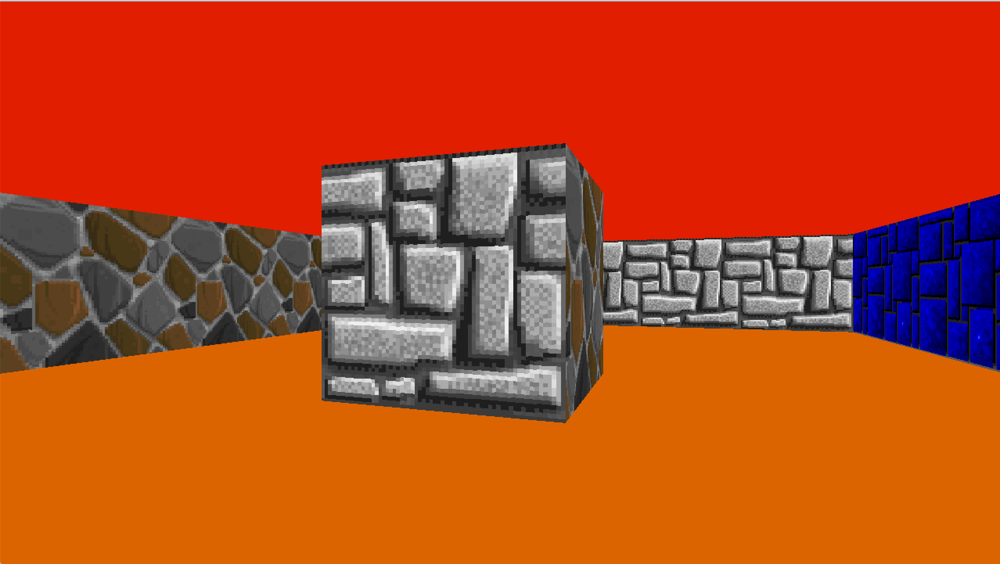

# Cub3D - 42 Project

## Introduction
Cub3D is a 3D rendering project developed at 42, inspired by early 3D games like Wolfenstein 3D. The game engine uses a technique called raycasting, which is responsible for rendering a 3D-like environment from a 2D map. The goal of the project is to implement a simplified 3D game engine based on this concept, creating a visually immersive experience while managing memory and performance effectively.

Brief History of John Carmack, Wolfenstein, and Raycasting
John Carmack is a legendary figure in the video game industry, known for his pioneering work in 3D graphics and game engines. He is especially recognized for his contributions to the development of Wolfenstein 3D (1992), a groundbreaking game that popularized the concept of 3D environments in video games. While Wolfenstein 3D wasn’t truly fully 3D, it utilized a technique called raycasting to simulate a 3D world by rendering walls and objects from a 2D plane.

Raycasting works by casting rays from a player's viewpoint and checking where they intersect with the walls or objects, then using this information to project a 3D-like environment.

## Map Parsing and Floodfill Algorithm
The map in Cub3D is represented as a 2D grid with values:

1 represents a cube or a solid wall

N, S, W, E represent the player's starting position and direction (North, South, West, East).

The parsing process involves reading the map file, identifying the player’s starting location, and determining the direction they are facing. The floodfill algorithm ensures that the map is closed, meaning all the areas are reachable and enclosed by walls, preventing open spaces from being rendered incorrectly.

## Code Explanation: MLX
The graphics library MLX (MiniLibX) is used to create the window and handle pixel drawing. It provides basic functions to set up the display, manage keyboard events, and render images. The code integrates MLX to display the game environment and implement real-time interactions such as player movement.

## DDA Algorithm and Bresenham's Line Algorithm
The DDA (Digital Differential Analyzer) algorithm is used to cast rays in the game. It calculates the intersection points of the rays with the walls by incrementally advancing the ray along its path. This allows the engine to determine the distance from the player to the nearest wall and render the environment accordingly.

Additionally, Bresenham’s Line Algorithm is employed to optimize the drawing of lines, such as the raycasting process, providing better performance for rendering.

## Texture Mapping
In Cub3D, textures are applied to walls to create a more realistic 3D effect. When a ray hits a wall, the code calculates which part of the texture should be displayed based on the intersection point’s position and the wall’s orientation. This provides the illusion of detailed 3D walls, enhancing the visual experience of the game.

## Result

## Conclusion
Cub3D is an impressive introduction to 3D game rendering techniques using raycasting. By implementing the DDA algorithm, Bresenham's Line Algorithm, texture mapping, and working with MLX, the project gives an in-depth look at the core concepts used in early 3D games. It’s a challenging yet rewarding project that enhances understanding of how 3D worlds can be simulated on 2D screens.

